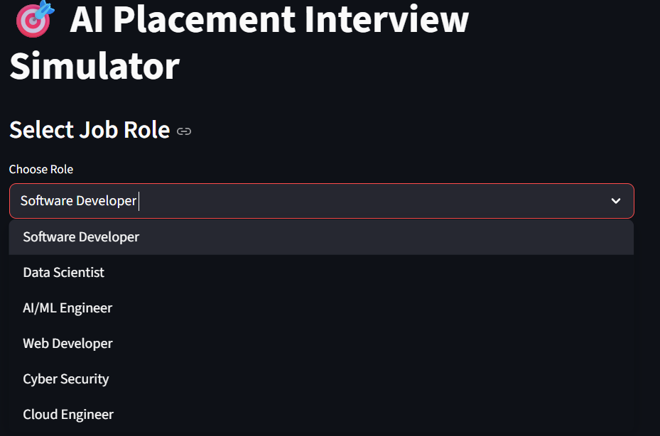
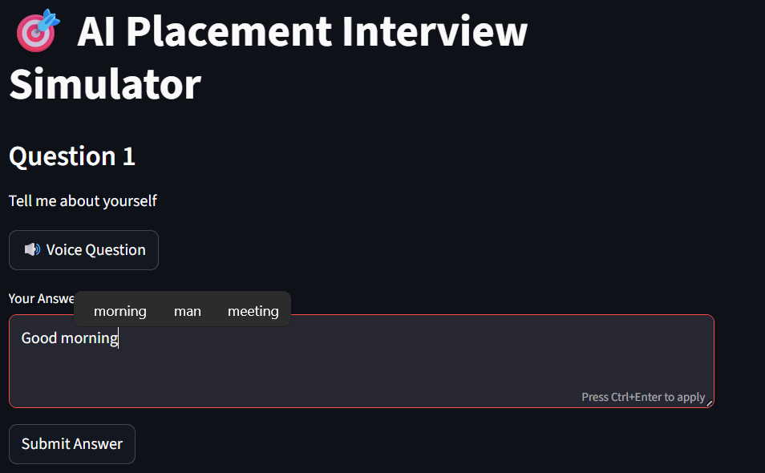
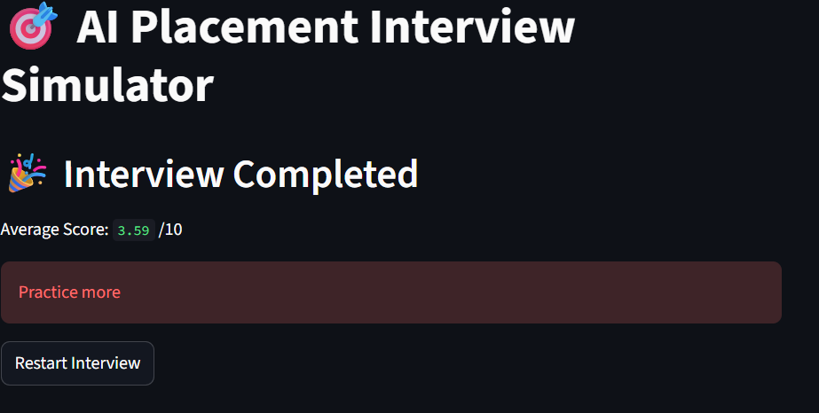

🎯 AI Placement Interview Simulator

📌 Project Overview

AI Placement Interview Simulator is a smart web-based application designed to help students prepare for technical interviews. It simulates real interview scenarios by asking questions and evaluating answers using AI techniques.

🚀 Features
1.🎤 Voice-based question 
2.🧠 AI-based answer evaluation using similarity algorithms
3.📊 Instant feedback on performance
4.💬 Multiple interview roles (HR / Technical)
5.⚡ Simple and user-friendly interface

🛠️ Technologies Used

1.Python
2.Streamlit
3.Scikit-learn
4.pyttsx3 (Text-to-Speech)

⚙️ How to Run the Project

1. Clone the repository:

   git clone https://github.com/Teja-2/AI-placement-interview-simulator.git

2. Navigate to the project folder:

   cd AI-placement-interview-simulator
  
3. Install required libraries:

   pip install -r requirements.txt

4. Run the application:
   
   streamlit run app.py

📷 Screenshots

💡 Future Improvements

1. Add more interview question datasets
2.Improve AI accuracy
3.Add multilingual support
4.Store user performance history

👨‍💻 Author

Teja
Manasa
Keerthi
Anu

📎 GitHub Repository

https://github.com/Teja-2/AI-placement-interview-simulator
